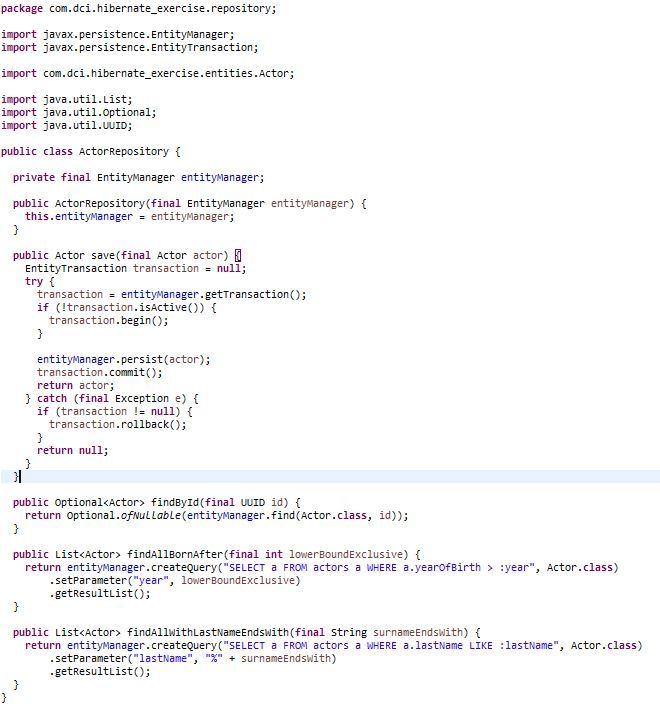

# Solution #  - Hibernate exercise

# Task 1

Sample pom.xml file:

 

hibernate.cfg.xml in the classpath:

 

Entities:

 

 

 

Main method sample :

   

# Task 2

 

Files changed in reference to task 1:

 

 

           

# Task 3

 

A sample class using this repository:              

 

# Task 4

 

# Task 5

 

Sample use:

 
